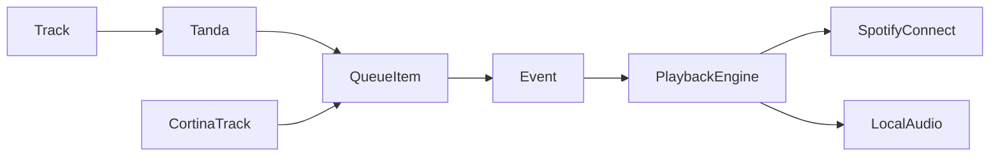

# Milonga DJ Assistant (TangoDJ)

## Decisions locked in

- **Stack:** Next.js 16 + React 19 + TypeScript + Tailwind v4 (same shape as [Spotiwrapped](c:\Users\Admin\Desktop\Projects\Spotiwrapped)), greenfield in [TangoDJ](c:\Users\Admin\Desktop\Projects\TangoDJ).
- **Auth:** Spotify OAuth PKCE (reuse patterns from `Spotiwrapped/src/lib/auth.ts` + `SpotifyContext`), with expanded playback scopes.
- **Playback primary:** **Spotify Connect** — control the **Spotify desktop/mobile app** (or speakers) as the audio engine. No Web Playback SDK as the main path. Quality follows the Spotify app’s settings (Very High / HiFi where available).
- **Playback secondary:** Local **MP3** via HTML5 `<audio>` (simplest reliable path; no third-party player lib required).
- **Sync:** **Supabase** (Postgres + RLS), keyed by Spotify user id, for library metadata, tandas, and saved events. Local audio files stay on the machine; only paths/metadata sync.
- **Platforms:** Desktop browser is the full DJ console. Phone = lightweight **remote** (now playing, pause/skip, next tanda/cortina) over Connect. Optional PWA install later.

## Domain model



- **Track:** `source` = `spotify` | `local`; genre = `tango` | `vals` | `milonga` | `cortina`; optional orchestra, year, singer; Spotify URI or local relative path.
- **Tanda:** named ordered list of 3–4 tracks, single genre (`tango`/`vals`/`milonga`), pre-approved.
- **Cortina:** track(s) from cortina category used as separators.
- **Event (milonga night):** named running order of queue items: `tanda` | `cortina`, with validation state.
- **Sequencing rule (enforced):** every tanda followed by a cortina; never two “fast” tandas (`vals`/`milonga`) back-to-back; prefer ~2 tango tandas between each fast tanda (same pattern as [El Recodo](https://www.el-recodo.com/tandascortinas-en?lang=en)).

## App surfaces (MVP)

| Surface | Desktop | Phone remote |
|--------|---------|--------------|
| Spotify login | yes | yes (token) |
| Library (4 categories) | yes | read-only optional |
| Tanda builder | yes | no |
| Event / queue builder + validate + auto-fill | yes | no |
| DJ Now Playing | yes (full) | yes (slim) |
| Device picker (Connect) | yes | yes |
| Local folder import | yes (Chrome/Edge) | no |

### Screens

1. **Login** — Spotify PKCE (port Spotiwrapped flow; fix localhost vs 127.0.0.1).
2. **Library** — tabs: Tango / Vals / Milonga / Cortinas; search Spotify; attach local files; tag orchestra.
3. **Tandas** — create/edit named tandas from one category; size hints (4 tango / 3 vals|milonga).
4. **Events** — build night queue (drag/reorder); validate rule; auto-generate from tanda pool; save/reload named events.
5. **DJ View** — current tanda + track index, next item, cortina countdown, pause/skip/reorder; large touch-friendly controls for remote.

## Playback architecture

Unified **queue controller** owns the night order and advances items. Per track it dispatches:

- **Spotify:** `PUT /me/player/play` with `device_id` + `uris` (or playlist-of-one / context for a tanda batch). Poll `GET /me/player` for position. Transfer: `PUT /me/player` to move to desktop app.
- **Local:** HTML5 Audio with object URLs / File handles; advance on `ended`.

**Device UX:** On load, list Connect devices; prefer a device named like “Spotify Desktop” / last used. Prompt: “Open Spotify app and press play once if no devices appear.”

**Mixed queues:** Allowed. If a Spotify track is next while local is playing (or vice versa), stop one engine and start the other. Show a clear source badge.

### Spotify scopes (add beyond Spotiwrapped)

`streaming` is **not** required for Connect control of an existing device. Need at least:

`user-read-playback-state`, `user-modify-playback-state`, `user-read-currently-playing`, plus library/search scopes (`user-library-read`, `playlist-read-*`, `user-read-email`, `user-read-private`).

## Local files

- Desktop: **File System Access API** — user picks a root folder expected like:

```
MyTango/
  Tango/
  Vals/
  Milonga/
  Cortina/
```

- Scan MP3s into the matching genre; store relative path + display name + optional manual orchestra tag.
- Persist folder permission via IndexedDB (`FileSystemHandle`); files are **not** uploaded to Supabase.
- On phone / non-supporting browsers: local playback unavailable; Spotify + synced library still work.

## Cloud sync (Supabase)

Tables (sketch):

- `profiles` — `spotify_user_id` PK, display name
- `tracks` — metadata + `spotify_uri` nullable + `local_rel_path` nullable + genre
- `tandas` / `tanda_tracks` — ordered membership
- `events` / `event_items` — ordered tanda/cortina refs

RLS: row ownership by `spotify_user_id`. Client uses Supabase JS with a short-lived session: after Spotify login, Next API route `POST /api/auth/supabase` verifies Spotify profile and issues a Supabase JWT (or use Supabase custom auth with Spotify user id claim). Simpler MVP alternative: store data under Spotify user id with service-role writes only through authenticated API routes that check Spotify access token — prefer **API routes that validate Spotify token + upsert**, if custom JWT is heavier for v1.

**Chosen for MVP:** Next.js API routes validate the caller’s Spotify access token (`GET https://api.spotify.com/v1/me`), then read/write Supabase with the service role scoped to that Spotify user id. Keeps auth to one provider (Spotify).

## Core domain logic (pure TS modules)

- `src/lib/domain/sequencing.ts` — validate queue; detect fast-after-fast; suggest next genre; auto-generate night from tanda pool + cortina pool.
- `src/lib/domain/tanda.ts` — size/genre consistency checks.
- `src/lib/playback/queueController.ts` — state machine for play/pause/skip/advance.
- `src/lib/playback/spotifyConnect.ts` — device list, play uris, transfer, poll.
- `src/lib/playback/localAudio.ts` — HTML5 wrapper.
- Reuse adapted: `auth.ts`, `spotify.ts`, `SpotifyContext` from Spotiwrapped.

## Nice-to-have (explicitly defer after MVP)

- Orchestra/song recommendations for new tandas
- Full PWA offline shell
- Uploading MP3s to cloud
- Web Playback SDK fallback

## Implementation order

1. Scaffold Next app in `TangoDJ`, env templates, Tailwind, basic shell.
2. Port Spotify PKCE + context; add Connect scopes and device/player API helpers.
3. Supabase schema + API sync routes; local React state hydrated from API.
4. Library UI + Spotify search add + local folder import.
5. Tanda CRUD + Event builder with sequencing validate + auto-fill.
6. Unified playback (Connect + local) + desktop DJ view.
7. Slim mobile remote route (`/remote`) with responsive controls.
8. README: Spotify Dashboard redirect URIs, Supabase setup, folder layout, quality tip (set Spotify app to Very High).

## Env / setup the user will need

- Spotify Developer app: Client ID, redirect `http://127.0.0.1:3000/callback` (and production URL later).
- Supabase project: URL + service role (server) + anon if needed.
- `.env.local`: `NEXT_PUBLIC_SPOTIFY_CLIENT_ID`, `NEXT_PUBLIC_SPOTIFY_REDIRECT_URI`, `SUPABASE_URL`, `SUPABASE_SERVICE_ROLE_KEY`.
